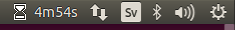

# About

A simple cross platform systray stopwatch, written in go

### Background

Testing out making a cross platform desktop app with go

### macOS

    go get -v -u github.com/jteeuwen/go-bindata/...
    make app

To create app bundle in build/Gotime.app

or

    make dmg

to create build/Gotime.dmg

### Linux

On Ubuntu: sudo apt-get install libgtk-3-dev libappindicator3-dev

    go get github.com/martinlindhe/timer/cmd/gotime

# TODO
* windows: .ico systray icon
* sound when timer finish
* menu separator, see https://github.com/getlantern/systray/pull/12

### License

Under [MIT](LICENSE)
